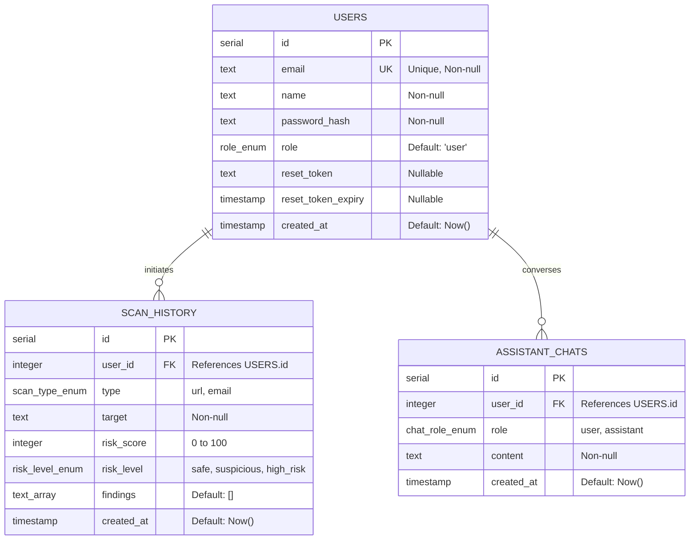

# PhishGuard — Database Documentation

This document describes the schema design, entities, columns, relationships, constraints, and indexes of the **PhishGuard** relational database, managed using **Drizzle ORM** with a **PostgreSQL** dialect (hosted via **Supabase**).

---

## 1. Entity-Relationship (ER) Diagram Overview

---

## 2. Table Specifications

### 2.1. `users` Table
Stores user credentials, profiles, roles, and password recovery states.

- **Purpose**: Identity Management & Role-Based Access Control (RBAC).
- **Columns**:

| Column Name | Data Type | Constraints | Default | Purpose / Description |
| :--- | :--- | :--- | :--- | :--- |
| `id` | `serial` | `PRIMARY KEY` | *Auto-increment* | Unique identifier for each user |
| `email` | `text` | `NOT NULL`, `UNIQUE` | *None* | User email address used for login |
| `name` | `text` | `NOT NULL` | *None* | Display name of the user |
| `password_hash` | `text` | `NOT NULL` | *None* | Cryptographically hashed password (bcrypt) |
| `role` | `role` (Enum) | `NOT NULL` | `'user'` | Role of user: `'user'` or `'admin'` |
| `reset_token` | `text` | `NULLABLE` | `null` | Token issued for password reset request |
| `reset_token_expiry`| `timestamp` | `NULLABLE` | `null` | Expiry timestamp of reset token |
| `created_at` | `timestamp` | `NOT NULL` | `now()` | Record creation timestamp |

- **Indexes**:
  - `users_email_unique_idx`: Unique index on `email` to accelerate authentication queries and enforce unique constraints.

---

### 2.2. `scan_history` Table
Logs all URL and email scans performed by users.

- **Purpose**: Auditing threat history, populating charts, and feeding security dashboards.
- **Columns**:

| Column Name | Data Type | Constraints | Default | Purpose / Description |
| :--- | :--- | :--- | :--- | :--- |
| `id` | `serial` | `PRIMARY KEY` | *Auto-increment* | Unique scan entry identifier |
| `user_id` | `integer` | `FOREIGN KEY` | `null` | Reference to `users.id` (Nullable for guest trials if allowed) |
| `type` | `scan_type` (Enum)| `NOT NULL` | *None* | Scan type: `'url'` or `'email'` |
| `target` | `text` | `NOT NULL` | *None* | Scanned target value (URL or Email subject representation) |
| `risk_score` | `integer` | `NOT NULL` | *None* | Aggregated vulnerability/risk index (0–100) |
| `risk_level` | `risk_level` (Enum)|`NOT NULL` | *None* | Evaluated classification: `'safe'`, `'suspicious'`, `'high_risk'` |
| `findings` | `text[]` | `NOT NULL` | `ARRAY[]` | Array of structural and external indicator alerts |
| `created_at` | `timestamp` | `NOT NULL` | `now()` | Scan completion timestamp |

- **Relationships**:
  - `user_id` references `users(id)` with a `ON DELETE CASCADE` relationship behavior.
- **Indexes**:
  - `scan_history_user_id_idx`: Improves execution time of pagination queries on user history.
  - `scan_history_created_at_idx`: Accelerates time-series range aggregations for the dashboards.

---

### 2.3. `assistant_chats` Table
Maintains persistent conversational context with the Companion AI Assistant.

- **Purpose**: Reconstructs secure chat histories.
- **Columns**:

| Column Name | Data Type | Constraints | Default | Purpose / Description |
| :--- | :--- | :--- | :--- | :--- |
| `id` | `serial` | `PRIMARY KEY` | *Auto-increment* | Unique chat bubble identifier |
| `user_id` | `integer` | `FOREIGN KEY` | `null` | Reference to `users.id` |
| `role` | `chat_role` (Enum)| `NOT NULL` | *None* | Speaker identity: `'user'` or `'assistant'` |
| `content` | `text` | `NOT NULL` | *None* | Chat content payload |
| `created_at` | `timestamp` | `NOT NULL` | `now()` | Message dispatch timestamp |

- **Relationships**:
  - `user_id` references `users(id)` with `ON DELETE CASCADE`.
- **Indexes**:
  - `assistant_chats_user_id_created_at_idx`: Compound index on `(user_id, created_at)` to swiftly retrieve chronological chat logs per session.

---

## 3. Database Custom Types & Enums

The following custom enums are declared natively within the Postgres server to ensure strict data validation:

1. **`role`**:
   - Values: `['user', 'admin']`
   - Purpose: Directs routing permissions on secure dashboards.
2. **`scan_type`**:
   - Values: `['url', 'email']`
   - Purpose: Maps scans to correct analysis processors.
3. **`risk_level`**:
   - Values: `['safe', 'suspicious', 'high_risk']`
   - Purpose: Controls UI alerts and badges.
4. **`chat_role`**:
   - Values: `['user', 'assistant']`
   - Purpose: Distinguishes sender components in standard chat bubbles.
